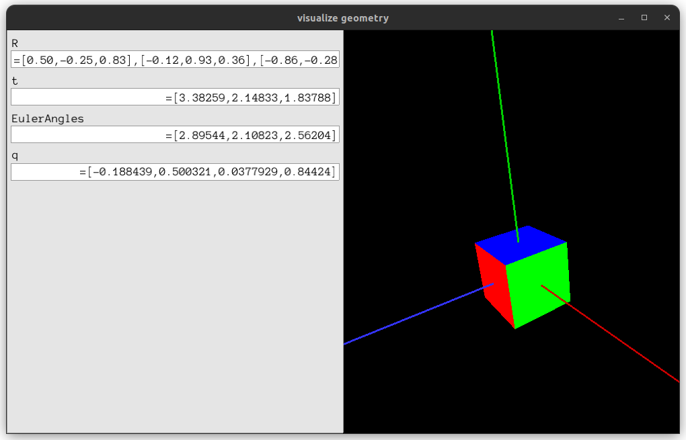
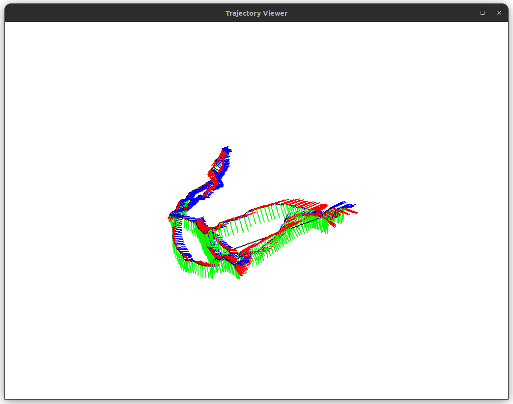
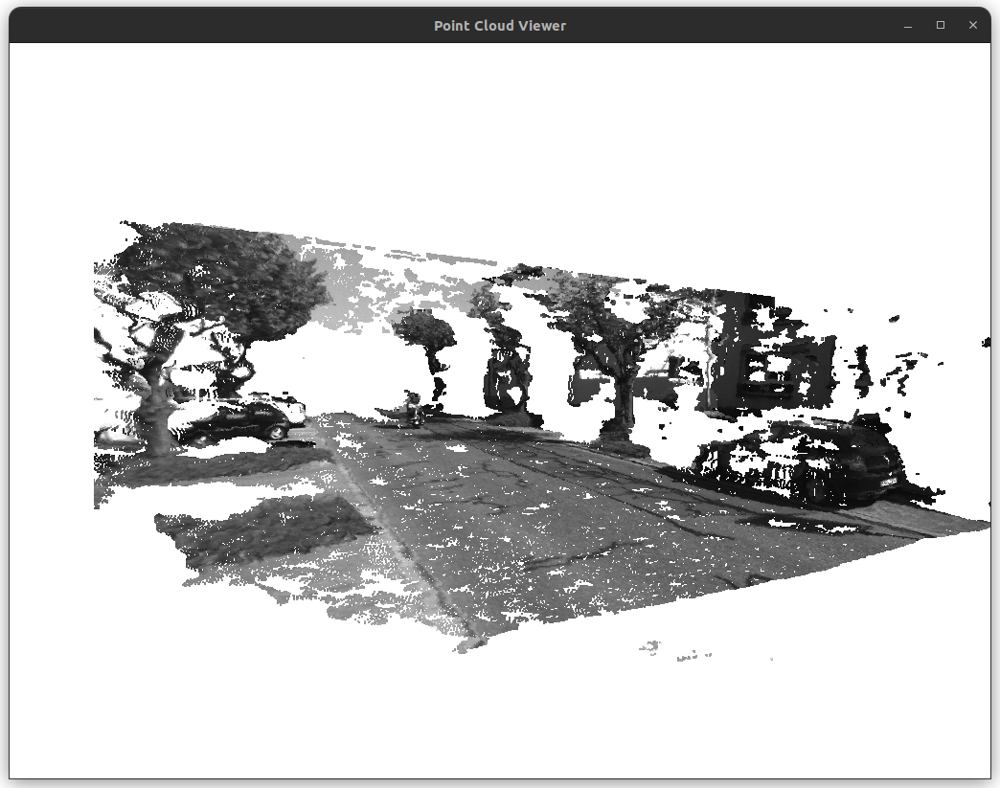
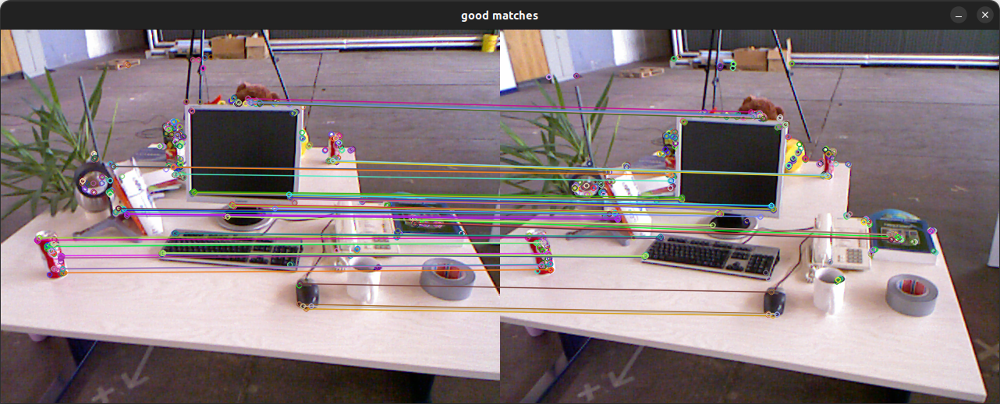
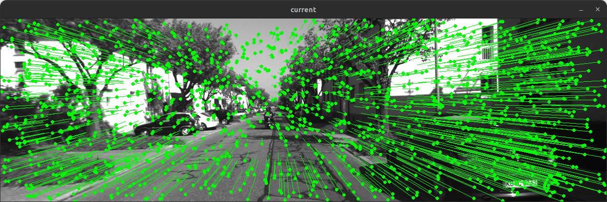
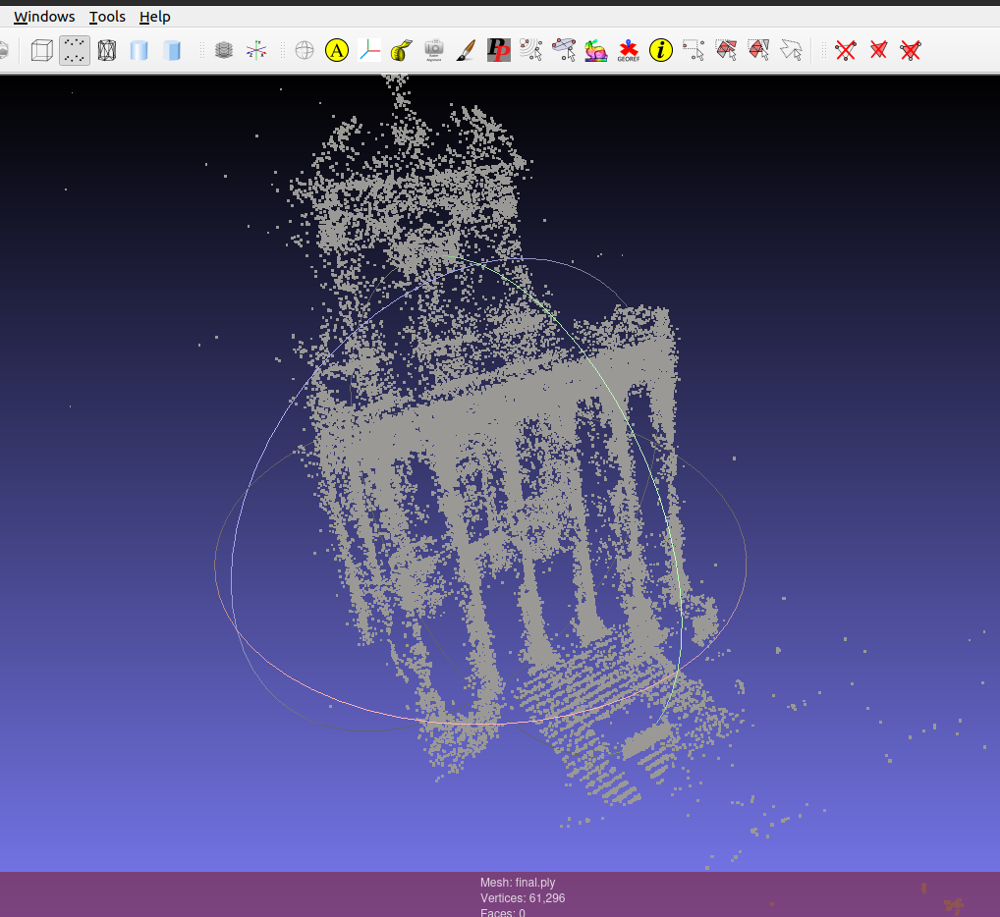

# Visual Odometry and VisualSLAM basics in C++
This repository contains basics and implementations required for Visual Odometry and VisualSLAM.

## Dependencies
1. CMake
2. Pangolin <https://github.com/stevenlovegrove/Pangolin>
3. Eigen3
4. Sophus <https://github.com/strasdat/Sophus.git>
5. Opencv4
6. boost
7. g2o <https://github.com/RainerKuemmerle/g2o>
8. Ceres <https://github.com/ceres-solver/ceres-solver.git>
9. DBoW3 <https://github.com/rmsalinas/DBow3.git> 
10. Meshlab (for visualizing ply file) 

## CPP and Cmake
- Very Basic C++ and CMake examples.
- Refer to ```CPPandCmake```

## Eigen3 and Pangolin
- Implementation of ```Eigen3``` template library for linear algebra: matrices, vectors, numerical solvers, and related algorithms.
- **3D Trajectory plotter** using ```Eigen3``` and ```Pangolin```.
- Display camera's Rotation matrix, Euler Angles, Translation vector and Quaternion visualizer.
- Refer to ```Eigen3AndPangolin```


## Sophus Lie groups and Lie algebra
- Implementations and usage of the Sophus library for Lie groups and Lie algebra
- Refer to Sophus_LieGroups folder



## OpenCV and 3D Vision
- Intro to ```OpenCV``` basics.
- Mapping point clouds from stereo and RGBD camera images.
- Refer to ```OpenCVand3DVision``` folder



## Non Linear Optimization
- Examples of employing ```Ceres```, ```g2o``` libraries for non linear optimization through curve fitting.
- Refer to ```NonlinearOptimization``` folder

## Features and Pose Estimation
- ```ORB feature``` extraction using ```OpenCV``` and another **ORB feautre extraction from scratch** for an **ORB pattern**
- ```Pose estimation of Camera```  using 2d-2d(for monocular), 3d-2d(PnP) and 3d-3d(ICP) pose estimations.
- Estimating keypoints depth by ```triangulation``` in ```OpenCV```. 
- Refer to ```Features&PoseEstimation``` folder



## Optical Flow
- Implementing Single level, Pyramid and OpenCV based LK optical flows, which is Feature based
- Implementing Multi level Optical flow estimation using Direct method, which is by minimizing the photogrammetric error.
- Refer to ```OpticalFlow``` folder



## Bundle Adjustment
- Implementing bundle adjustment using ```Ceres``` and ```g2o``` in the BAL dataset.
- Refer to ```BundleAdjustment``` folder



## Loop Closure
- Using Bag of Words, to describe an image by clustering feature points. ```DBoW3``` library example using TUM dataset images.
- Refer to ```LoopClosure``` folder  